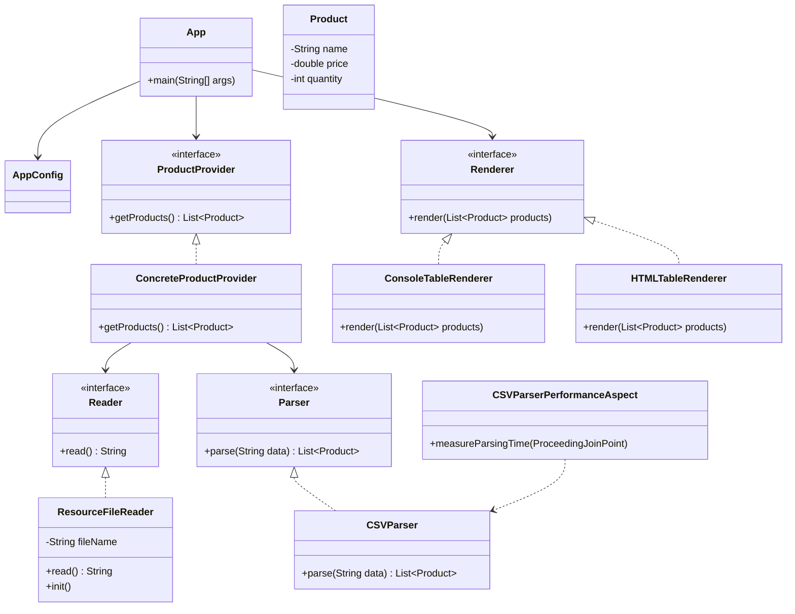

# Отчет о лабораторной работе

## Цель работы

Изучение Gradle и Spring Framework.

## Выполнение работы

- установлен JDK 17;
- установлен Gradle 8.12;
- создан Java Application проект;
- подключен Spring Context;
- реализован интерфейс `Reader`;
- реализован `CSVParser`;
- реализован `ProductProvider`;
- реализован `ConsoleTableRenderer`;
- реализована загрузка CSV-файла;
- реализован вывод таблицы товаров;
- реализован `HTMLTableRenderer`;
- добавлена конфигурация Spring с использованием `@Configuration` и `@ComponentScan`;
- добавлен `ResourceFileReader` с использованием `@Value`;
- добавлен `@PostConstruct` для выполнения метода после создания компонента;
- добавлен аспект для измерения времени парсинга CSV-файла.

## Выводы

В ходе лабораторной работы было создано Java-приложение с использованием
Gradle и Spring Framework.

Была реализована загрузка данных о товарах из CSV-файла, их парсинг
и вывод в виде таблицы. Также была реализована HTML-версия таблицы товаров.

Приложение успешно запускается с помощью команды:

```text
gradle run
```

и корректно обрабатывает данные из CSV-файла.

## UML-диаграмма классов

