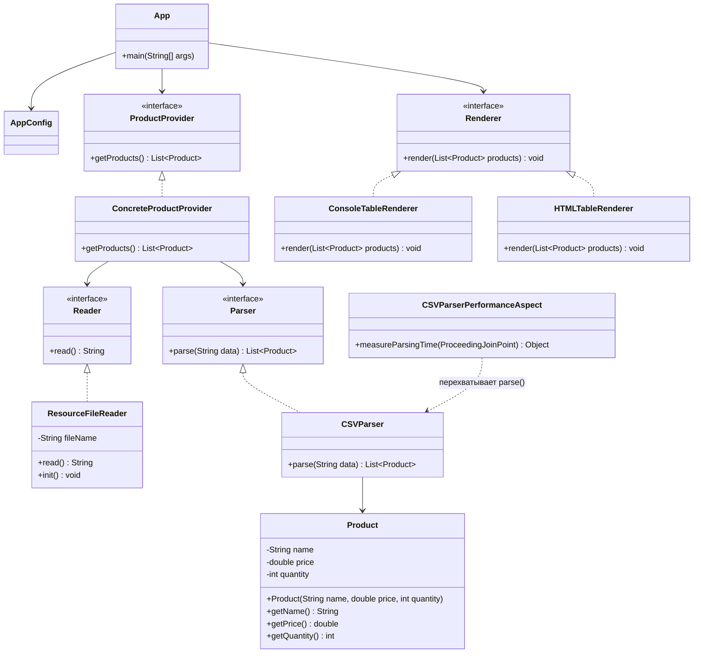

# Отчет о лабораторной работе №3

## Цель работы

Изучить конфигурирование Spring-приложения с помощью аннотаций, научиться
использовать автоматическое внедрение зависимостей, конфигурационные
параметры и события жизненного цикла бинов.

Освоить применение Spring AOP для измерения времени выполнения методов.

## Выполнение работы

### 1. Перенос приложения из лабораторной работы №1

Результат выполнения лабораторной работы №1 был скопирован в директорию
`les04/lab`.

Приложение представляет собой консольное приложение для работы с товарами
зоомагазина. Данные о товарах загружаются из CSV-файла.

### 2. Конфигурирование с помощью аннотаций

Конфигурация приложения была переведена с ручного создания бинов с помощью
`@Bean` на автоматическое обнаружение компонентов с помощью `@Component`.

Следующие классы были зарегистрированы как Spring-компоненты:

- `ResourceFileReader`
- `CSVParser`
- `ConcreteProductProvider`
- `ConsoleTableRenderer`
- `HTMLTableRenderer`
- `CSVParserPerformanceAspect`

Для автоматического поиска компонентов используется:

```java
@ComponentScan("ru.bsuedu.cad.lab")
```

Таким образом, Spring автоматически обнаруживает и создаёт необходимые
компоненты приложения.

### 3. Внедрение зависимостей

Для получения зависимостей используется механизм автоматического внедрения
Spring.

Компоненты приложения взаимодействуют между собой через интерфейсы
`Reader`, `Parser`, `ProductProvider` и `Renderer`.

В результате зависимости между классами не создаются вручную, а
предоставляются контейнером Spring.

### 4. Работа с конфигурационными параметрами

Для хранения имени CSV-файла используется файл:

```text
app/src/main/resources/application.properties
```

В нём задаётся параметр:

```properties
products.file=products.csv
```

В классе `ResourceFileReader` значение параметра внедряется с помощью
аннотации `@Value`:

```java
@Value("${products.file}")
private String fileName;
```

Это позволяет изменить имя используемого файла без изменения исходного
кода программы.

### 5. Работа с ресурсами приложения

Класс `ResourceFileReader` используется для чтения CSV-файла из ресурсов
приложения.

Для доступа к файлу используется:

```java
var resource = new ClassPathResource(fileName);
```

Полученное содержимое файла передаётся далее в `CSVParser`, который
преобразует данные CSV в список объектов `Product`.

### 6. Событие жизненного цикла Spring Bean

В класс `ResourceFileReader` был добавлен метод, выполняемый после создания
Spring Bean.

Для этого используется аннотация:

```java
@PostConstruct
public void init() {
    System.out.println(
        "ResourceFileReader инициализирован: " +
        java.time.LocalDateTime.now()
    );
}
```

При запуске приложения в консоли появляется сообщение об инициализации
`ResourceFileReader`.

Таким образом была продемонстрирована работа с жизненным циклом Spring Bean.

### 7. Реализация HTML-рендеринга

В дополнение к консольному выводу была реализована ещё одна реализация
интерфейса `Renderer` — `HTMLTableRenderer`.

Данный компонент формирует HTML-страницу с таблицей товаров.

Результат сохраняется в файл:

```text
products.html
```

В таблицу выводятся:

- идентификатор товара;
- название;
- описание;
- категория;
- цена;
- количество товара.

Таким образом, приложение поддерживает несколько способов отображения
полученных данных.

### 8. Использование Spring AOP

Для измерения времени выполнения метода парсинга CSV был создан аспект
`CSVParserPerformanceAspect`.

Аспект перехватывает выполнение метода:

```java
CSVParser.parse(...)
```

Для измерения времени используется:

```java
long start = System.nanoTime();

Object result = joinPoint.proceed();

long end = System.nanoTime();
```

После выполнения метода вычисляется затраченное время:

```java
long elapsed = end - start;
```

Полученное значение выводится в консоль:

```text
Время парсинга CSV: ... нс
```

Для перехвата метода используется аннотация:

```java
@Around("execution(* ru.bsuedu.cad.lab.CSVParser.parse(..))")
```

Таким образом, измерение времени выполнения метода выполняется отдельно
от основной логики парсера.

### 9. Запуск приложения

Для проверки работы приложения использовалась команда:

```text
gradle run
```

Также приложение успешно запускалось с помощью Gradle Wrapper:

```powershell
.\gradlew clean run
```

В процессе запуска Spring создаёт необходимые компоненты, выполняется
инициализация `ResourceFileReader`, считывается CSV-файл и выполняется
его парсинг.

В консоли выводится время выполнения парсинга, например:

```text
Время парсинга CSV: 1207900 нс
```

После выполнения программа завершается без ошибок:

```text
BUILD SUCCESSFUL
```

## Выводы

В ходе лабораторной работы было изучено конфигурирование приложения
с использованием Spring Framework.

Было реализовано автоматическое обнаружение компонентов с помощью
`@ComponentScan` и `@Component`, а также автоматическое внедрение
зависимостей между компонентами приложения.

Была реализована работа с конфигурационными параметрами через
`application.properties` и `@Value`.

С помощью `@PostConstruct` была продемонстрирована работа с жизненным
циклом Spring Bean.

Также была реализована дополнительная HTML-визуализация товаров.

С использованием Spring AOP был создан аспект, измеряющий время выполнения
метода парсинга CSV-файла. Полученное время выводится в консоль в
наносекундах.

В результате приложение успешно запускается с помощью Gradle, считывает
данные из CSV-файла, обрабатывает их и выводит время выполнения парсинга.

## UML-диаграмма классов

