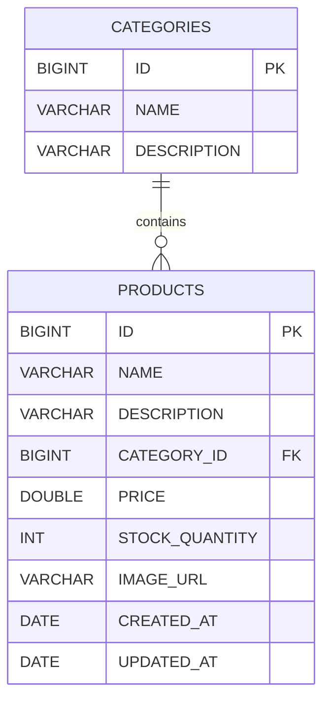
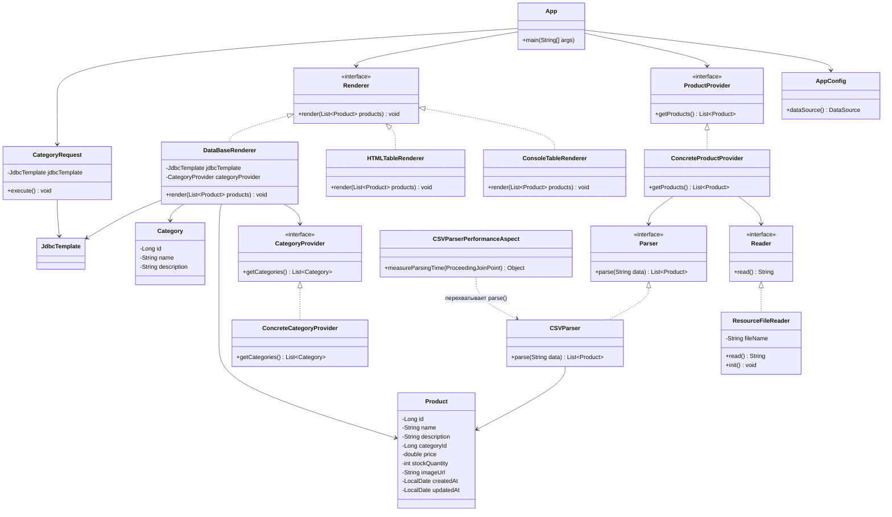

# Лабораторная работа 4. Технологии работы с базами данных. JDBC

## Цель работы

Целью лабораторной работы является изучение технологий работы с базами
данных в Java-приложениях с использованием JDBC и инструментов Spring
Framework: `DataSource`, `JdbcTemplate`, `RowMapper`.

В ходе работы необходимо научить приложение сохранять данные о товарах
и категориях во встроенную базу данных H2, а также выполнять SQL-запросы
к базе данных и выводить результаты в консоль с помощью библиотеки
логирования Logback.

---

## Выполнение работы

### 1. Перенос приложения из лабораторной работы №2

Результат выполнения предыдущей лабораторной работы был скопирован
в директорию `les06/lab`.

Приложение предназначено для работы с товарами зоомагазина. Данные
о товарах загружаются из CSV-файла и обрабатываются с помощью
существующих компонентов приложения.

---

### 2. Подключение базы данных H2

В приложение была подключена встраиваемая база данных H2.

Для создания базы данных используется `EmbeddedDatabaseBuilder`.

В конфигурации приложения создаётся `DataSource`, который использует
H2:

```java
@Bean
public DataSource dataSource() {
    return new EmbeddedDatabaseBuilder()
            .setType(EmbeddedDatabaseType.H2)
            .addScript("classpath:schema.sql")
            .build();
}
```

При запуске приложения автоматически выполняется SQL-скрипт
`schema.sql`.

---

### 3. Создание таблиц базы данных

Для создания структуры базы данных был создан файл:

```text
app/src/main/resources/schema.sql
```

В базе данных создаются две таблицы:

- `CATEGORIES` — категории товаров;
- `PRODUCTS` — товары.

Таблица `PRODUCTS` связана с таблицей `CATEGORIES` с помощью внешнего
ключа `CATEGORY_ID`.

Структура базы данных представлена на диаграмме:



---

### 4. Работа с категориями

Для моделирования категории был создан класс `Category`.

Также был создан интерфейс `CategoryProvider` и его реализация
`ConcreteCategoryProvider`.

`ConcreteCategoryProvider` считывает данные из CSV-файла:

```text
category.csv
```

Файл находится в директории:

```text
app/src/main/resources
```

Полученные строки CSV преобразуются в объекты `Category`.

---

### 5. Работа с товарами

Для работы с товарами используется класс `Product`.

Данные о товарах хранятся в файле:

```text
products.csv
```

Файл располагается в:

```text
app/src/main/resources/products.csv
```

CSV-файл содержит следующую информацию:

- идентификатор товара;
- название;
- описание;
- идентификатор категории;
- цену;
- количество товара на складе;
- ссылку на изображение;
- дату создания;
- дату обновления.

Данные считываются и преобразуются в объекты `Product`.

---

### 6. Реализация DataBaseRenderer

Для сохранения данных в базу данных была создана новая реализация
интерфейса `Renderer` — `DataBaseRenderer`.

Для выбора данного компонента по умолчанию используется аннотация:

```java
@Primary
```

`DataBaseRenderer` использует `JdbcTemplate` для выполнения SQL-запросов.

Сначала в таблицу `CATEGORIES` добавляются категории:

```sql
INSERT INTO CATEGORIES (ID, NAME, DESCRIPTION)
VALUES (?, ?, ?)
```

После этого в таблицу `PRODUCTS` добавляются товары:

```sql
INSERT INTO PRODUCTS
(ID, NAME, DESCRIPTION, CATEGORY_ID, PRICE,
 STOCK_QUANTITY, IMAGE_URL, CREATED_AT, UPDATED_AT)
VALUES (?, ?, ?, ?, ?, ?, ?, ?, ?)
```

Таким образом, данные из CSV-файлов сохраняются во встроенной базе
данных H2.

---

### 7. Выполнение запроса к базе данных

Для выполнения запроса к базе данных был создан класс `CategoryRequest`.

В классе используется `JdbcTemplate`.

Необходимо получить список категорий, количество товаров в которых
больше одного.

Для этого используется SQL-запрос:

```sql
SELECT c.NAME, COUNT(p.ID) AS PRODUCT_COUNT
FROM CATEGORIES c
JOIN PRODUCTS p ON p.CATEGORY_ID = c.ID
GROUP BY c.ID, c.NAME
HAVING COUNT(p.ID) > 1
```

Условие:

```sql
HAVING COUNT(p.ID) > 1
```

позволяет выбрать только те категории, в которых находится более одного
товара.

Результат запроса преобразуется в список и выводится в консоль.

---

### 8. Логирование результата

Для вывода результатов запроса используется библиотека Logback.

Результат выполнения `CategoryRequest` выводится с уровнем логирования:

```text
INFO
```

Таким образом, приложение выполняет SQL-запрос к базе данных и выводит
полученный результат в лог.

---

### 9. Запуск и проверка приложения

Для проверки работы приложения использовалась команда:

```powershell
.\gradlew clean run
```

При запуске приложения:

1. создаётся контекст Spring;
2. запускается встроенная база данных H2;
3. выполняется `schema.sql`;
4. создаются таблицы `CATEGORIES` и `PRODUCTS`;
5. считываются данные из CSV-файлов;
6. `DataBaseRenderer` сохраняет категории и товары в базу данных;
7. `CategoryRequest` выполняет SQL-запрос;
8. результат запроса выводится через Logback.

Приложение успешно завершает выполнение:

```text
BUILD SUCCESSFUL
```

---

## UML-диаграмма классов



---

## Выводы

В ходе лабораторной работы была реализована работа Java-приложения
с базой данных с использованием JDBC и Spring Framework.

Была подключена встроенная база данных H2 и настроено автоматическое
создание таблиц `CATEGORIES` и `PRODUCTS` при запуске приложения.

Были реализованы классы для работы с категориями и загрузки данных
из CSV-файла.

С помощью `DataBaseRenderer` и `JdbcTemplate` данные о категориях
и товарах сохраняются в базу данных.

Также был реализован класс `CategoryRequest`, выполняющий SQL-запрос
для получения категорий, содержащих более одного товара.

Результат запроса выводится с помощью Logback на уровне `INFO`.

Приложение успешно запускается с помощью Gradle, выполняет необходимые
операции с базой данных и завершается без ошибок.