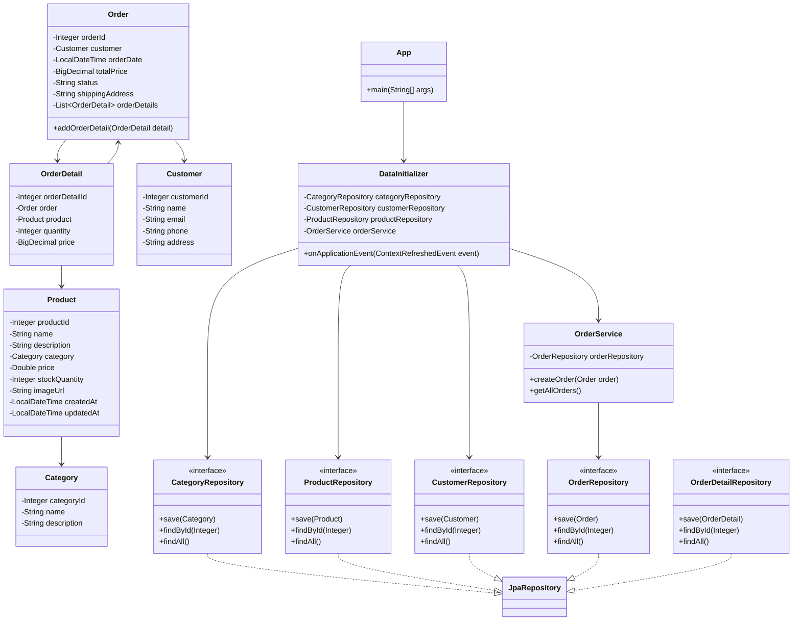

# Лабораторная работа №5. Технологии работы с базами данных. JPA. Spring Data

## Цель работы

Изучить технологии работы с базами данных в Java-приложениях с использованием ORM Hibernate и Spring Data JPA.

В ходе работы необходимо выполнить рефакторинг приложения магазина зоотоваров, перейти от Spring JDBC к ORM Hibernate и Spring Data, реализовать слоистую архитектуру приложения, создать JPA-сущности, репозитории и сервис для работы с заказами.

## Выполнение работы

### 1. Подключение H2 и Hibernate

В приложение подключена встроенная база данных H2.

Для работы с базой данных используется `HikariDataSource`.

Для объектно-реляционного отображения используется Hibernate ORM и Spring Data JPA.

Схема базы данных формируется автоматически на основании JPA-сущностей.

Используется база данных:

```text
jdbc:h2:mem:petshop
```

### 2. Структура проекта

Проект организован в соответствии со слоистой архитектурой:

```text
ru.bsuedu.cad.lab
├── entity
├── repository
├── service
└── app
```

#### Entity

В пакете `entity` находятся JPA-сущности:

- `Category`
- `Product`
- `Customer`
- `Order`
- `OrderDetail`

#### Repository

В пакете `repository` реализованы Spring Data JPA репозитории:

- `CategoryRepository`
- `ProductRepository`
- `CustomerRepository`
- `OrderRepository`
- `OrderDetailRepository`

Репозитории позволяют создавать записи, получать записи по идентификатору и получать список всех записей.

#### Service

В пакете `service` реализован сервис:

- `OrderService`

Сервис отвечает за создание заказа и получение списка всех заказов.

Создание заказа выполняется в рамках транзакции.

#### App

В основном пакете реализован запуск Spring-приложения.

Класс `DataInitializer` отвечает за загрузку исходных данных из CSV-файлов и создание тестового заказа.

### 3. Загрузка данных из CSV

Для заполнения базы данных используются следующие файлы:

- `category.csv`
- `customer.csv`
- `products.csv`

При запуске приложения данные загружаются в соответствующие таблицы базы данных.

После загрузки выполняется проверка количества записей:

```text
Категорий: 10
Покупателей: 10
Товаров: 10
```

### 4. Создание заказа

После загрузки исходных данных приложение создаёт тестовый заказ.

Заказ содержит:

- покупателя;
- товар;
- количество товара;
- цену;
- адрес доставки;
- статус заказа;
- дату заказа.

Создание заказа выполняется через `OrderService` в рамках транзакции.

После сохранения выполняется проверка наличия заказа в базе данных.

Результат выполнения:

```text
Заказ успешно создан. ID = 1
Количество заказов в БД: 1
```

### 5. Логирование

Для вывода информации используется библиотека Logback и SLF4J.

Основные операции приложения выводятся в лог с уровнем `INFO`.

При этом подробный отладочный вывод Hibernate отключён.

### 6. Запуск приложения

Для запуска приложения используется Gradle:

```powershell
.\gradlew clean run
```

Приложение успешно запускается и завершается с результатом:

```text
BUILD SUCCESSFUL
```

## UML-диаграмма классов



## Вывод

В ходе лабораторной работы приложение магазина зоотоваров было переведено с использования Spring JDBC на ORM Hibernate и Spring Data JPA.

Была реализована слоистая архитектура с разделением на сущности, репозитории, сервисы и приложение.

Данные из CSV-файлов успешно загружаются в базу данных H2. Реализовано создание заказа в рамках транзакции и проверка его сохранения в базе данных.

Приложение успешно запускается с помощью Gradle и завершается с результатом `BUILD SUCCESSFUL`.