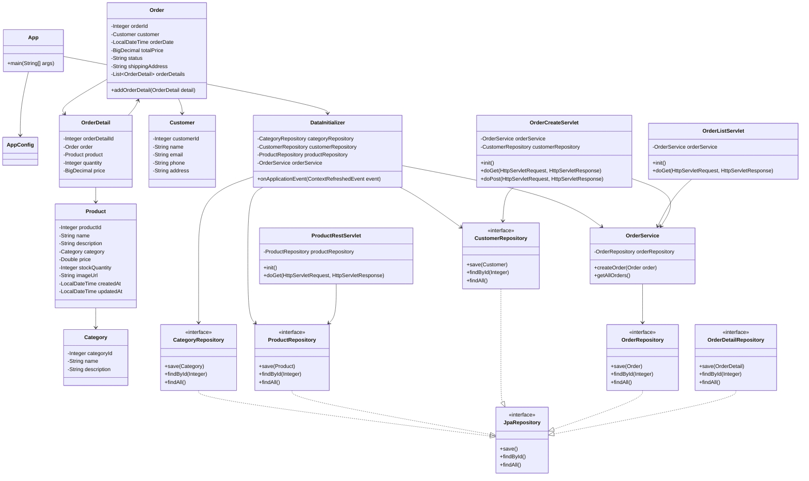

# Лабораторная работа №5

## Разработка Web-приложения

### Цель работы

Добавить Web-интерфейс и REST-сервис к приложению магазина зоотоваров, настроить Apache Tomcat, сформировать WAR-файл и выполнить развёртывание приложения.

---

## 1. Исходное приложение

За основу взят результат выполнения лабораторной работы №4 — приложение магазина зоотоваров с сущностями `Category`, `Product`, `Customer`, `Order` и `OrderDetail`.

---

## 2. Используемые технологии

- Java 17
- Gradle
- Spring Framework
- Spring Data JPA
- Hibernate
- Jakarta Servlet API
- Apache Tomcat 11.0.25
- H2 Database
- HTML/CSS
- REST API
- Postman
- Mermaid

---

## 3. Apache Tomcat

Установлен и настроен Apache Tomcat 11.0.25.

Сервер работает на порту `8080`.

Адрес:

http://localhost:8080

---

## 4. Пользователь Tomcat

В файле `tomcat-users.xml` добавлен пользователь с ролью `manager-gui`.

Панель управления Tomcat Manager:

http://localhost:8080/manager/html

---

## 5. WAR-файл

Проект настроен для формирования WAR-файла.

Сборка выполняется командой:

`.\gradlew clean war`

В результате формируется файл:

`app/build/libs/app.war`

WAR-файл размещён в директории `webapps` Apache Tomcat.

---

## 6. Сервлет списка заказов

Создан `OrderListServlet`.

Адрес:

http://localhost:8080/app/orders

Сервлет получает список заказов через `OrderService` и выводит информацию в HTML-таблице.

На странице также размещена кнопка перехода к форме создания заказа.

---

## 7. Форма создания заказа

Создан `OrderCreateServlet`.

Адрес:

http://localhost:8080/app/order/create

Форма позволяет выбрать покупателя, указать сумму заказа и адрес доставки.

После отправки формы создаётся новый заказ и выполняется переход к списку заказов.

---

## 8. REST-сервис продуктов

Создан `ProductRestServlet`.

Адрес:

http://localhost:8080/app/products

Сервис обрабатывает GET-запрос и возвращает для каждого продукта:

- название;
- название категории;
- количество на складе.

Данные возвращаются в формате JSON.

---

## 9. Сборка, развёртывание и тестирование

Приложение собрано с помощью Gradle и сформировано в виде WAR-файла.

WAR-файл развёрнут на Apache Tomcat.

Приложение доступно по адресу:

http://localhost:8080/app

REST-сервис протестирован в Postman с помощью GET-запроса:

http://localhost:8080/app/products

Получен успешный ответ:

`200 OK`

В ответе отображается список продуктов в формате JSON.

---

## 10. Результаты работы

В результате выполнения лабораторной работы:

- настроен Apache Tomcat 11.0.25;
- добавлен пользователь Tomcat Manager;
- настроена сборка приложения в формате WAR;
- создан файл `app.war`;
- приложение развёрнуто на Apache Tomcat;
- реализован `OrderListServlet`;
- реализован `OrderCreateServlet`;
- реализована форма создания заказа;
- реализовано создание нового заказа;
- после создания заказа выполняется переход к списку заказов;
- реализован `ProductRestServlet`;
- REST-сервис возвращает данные о продуктах в формате JSON;
- REST-сервис протестирован в Postman;
- получен успешный ответ `200 OK`;
- UML-диаграмма обновлена с учётом Web-слоя.

---
## 11. UML-диаграмма классов

Обновлённая диаграмма отражает структуру приложения после добавления Web-слоя.

В диаграмму добавлены классы:

- `OrderListServlet`;
- `OrderCreateServlet`;
- `ProductRestServlet`.

Также показаны связи между сущностями, репозиториями, `OrderService`, `DataInitializer` и Web-сервлетами.

---

## 12. Вывод

В ходе выполнения лабораторной работы к приложению магазина зоотоваров был добавлен Web-интерфейс и REST API.

Был настроен Apache Tomcat 11.0.25, выполнена сборка приложения в формате WAR и его развёртывание на сервере.

Реализованы сервлет для просмотра заказов, форма создания нового заказа и REST-сервис для получения информации о продуктах.

Работа REST-сервиса проверена с помощью Postman, получен успешный ответ `200 OK`.

В результате все основные задачи лабораторной работы выполнены. Архитектура приложения была расширена Web-компонентами, что отражено в обновлённой UML-диаграмме классов.