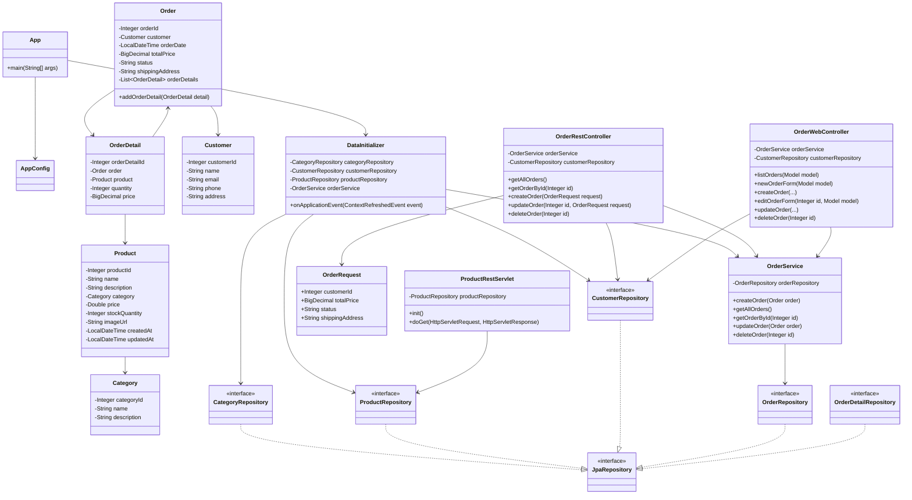

# Лабораторная работа №6

## Разработка Web-приложений с использованием технологии Spring MVC

### Цель работы

Разработать Web-приложение магазина зоотоваров с использованием Spring MVC, реализовать REST API для работы с заказами, подключить шаблонизатор Thymeleaf, реализовать Web-интерфейс для работы с заказами, выполнить сборку приложения в формате WAR и развернуть приложение на Apache Tomcat 11.

---

## 1. Исходное приложение

За основу взят результат выполнения предыдущих лабораторных работ — приложение магазина зоотоваров.

В приложении используются сущности:

- `Category`;
- `Product`;
- `Customer`;
- `Order`;
- `OrderDetail`.

Для работы с данными используются Spring Data JPA, Hibernate и H2 Database.

---

## 2. Используемые технологии

- Java 17;
- Gradle;
- Spring Framework;
- Spring MVC;
- Spring Data JPA;
- Hibernate;
- Thymeleaf;
- Jakarta Servlet API;
- Apache Tomcat 11.0.25;
- H2 Database;
- HTML/CSS;
- REST API;
- Postman;
- Mermaid.

---

## 3. Настройка Spring MVC

Для обработки Web-запросов добавлен Spring MVC.

Web-контроллер заказов:

`OrderWebController`

Контроллер использует аннотации:

- `@Controller`;
- `@RequestMapping`;
- `@GetMapping`;
- `@PostMapping`.

Основные маршруты Web-интерфейса:

| Метод | URL | Назначение |
|---|---|---|
| GET | `/orders` | список заказов |
| GET | `/orders/new` | форма создания заказа |
| POST | `/orders` | создание заказа |
| GET | `/orders/{id}/edit` | форма изменения заказа |
| POST | `/orders/{id}` | изменение заказа |
| POST | `/orders/{id}/delete` | удаление заказа |

---

## 4. REST API заказов

Для реализации REST API создан класс:

`OrderRestController`

Контроллер помечен аннотациями:

```java
@RestController
@RequestMapping("/api/orders")
```

Реализованы следующие операции:

| Метод | URL | Назначение |
|---|---|---|
| GET | `/api/orders` | получение списка заказов |
| GET | `/api/orders/{id}` | получение заказа по идентификатору |
| POST | `/api/orders` | создание заказа |
| PUT | `/api/orders/{id}` | изменение заказа |
| DELETE | `/api/orders/{id}` | удаление заказа |

Для создания и изменения заказа используется `OrderRequest`:

```java
public record OrderRequest(
        Integer customerId,
        BigDecimal totalPrice,
        String status,
        String shippingAddress
) {
}
```

### Получение списка заказов

Для получения списка всех заказов используется запрос:

```text
GET http://localhost:8080/app/api/orders
```

В результате сервер возвращает список заказов в формате JSON.

Получен успешный ответ:

```text
HTTP/1.1 200
```

Пример ответа:

```json
[
    {
        "orderId": 1,
        "customer": {
            "customerId": 1,
            "name": "Алексей Иванов",
            "email": "alex.ivanov@example.com",
            "phone": "+79261112233",
            "address": "Москва, ул. Ленина, д. 10"
        },
        "totalPrice": 1500.00,
        "status": "NEW",
        "shippingAddress": "Москва, ул. Ленина, д. 10"
    }
]
```

### Получение заказа по идентификатору

Для получения конкретного заказа используется:

```text
GET http://localhost:8080/app/api/orders/1
```

Получен ответ:

```text
HTTP/1.1 200
```

Для проверки обработки отсутствующего заказа был выполнен запрос:

```text
GET http://localhost:8080/app/api/orders/999
```

Получен ответ:

```text
HTTP/1.1 404
```

### Создание заказа

Для создания заказа используется:

```text
POST http://localhost:8080/app/api/orders
```

Тело запроса:

```json
{
    "customerId": 3,
    "totalPrice": 4000,
    "status": "NEW",
    "shippingAddress": "Москва, ул. Арбат, д. 15"
}
```

В результате был создан новый заказ.

Получен ответ:

```text
HTTP/1.1 201
```

### Изменение заказа

Для изменения существующего заказа используется:

```text
PUT http://localhost:8080/app/api/orders/2
```

Тело запроса:

```json
{
    "customerId": 2,
    "totalPrice": 5000,
    "status": "PAID",
    "shippingAddress": "Москва, ул. Тверская, д. 10"
}
```

Получен ответ:

```text
HTTP/1.1 200
```

Данные заказа были успешно изменены.

### Удаление заказа

Для удаления заказа используется:

```text
DELETE http://localhost:8080/app/api/orders/3
```

Получен ответ:

```text
HTTP/1.1 204 No Content
```

После выполнения запроса заказ был удалён.

Для проверки обработки отсутствующего заказа также был выполнен запрос:

```text
DELETE http://localhost:8080/app/api/orders/999
```

Получен ответ:

```text
HTTP/1.1 404
```

---

## 5. Деплой приложения и тестирование REST API

Приложение было развёрнуто на сервере Apache Tomcat 11.0.25.

Сервер работает на порту `8080`.

Адрес приложения:

```text
http://localhost:8080/app
```

REST API доступен по адресу:

```text
http://localhost:8080/app/api/orders
```

Для тестирования REST API использовался Postman.

Была создана коллекция:

```text
Lab 6 - Orders API
```

В коллекцию добавлены запросы:

1. `GET — Все заказы`;
2. `GET — Заказ по ID`;
3. `POST — Создать заказ`;
4. `PUT — Изменить заказ`;
5. `DELETE — Удалить заказ`.

В ходе тестирования REST API были получены следующие результаты:

| Операция | Результат |
|---|---|
| Получение списка заказов | `200 OK` |
| Получение заказа по ID | `200 OK` |
| Получение несуществующего заказа | `404 Not Found` |
| Создание заказа | `201 Created` |
| Изменение заказа | `200 OK` |
| Удаление заказа | `204 No Content` |
| Удаление несуществующего заказа | `404 Not Found` |

Таким образом, REST API работы с заказами работает корректно.

---

## 6. Подключение Thymeleaf и реализация Web-интерфейса

Для формирования HTML-страниц был подключён шаблонизатор Thymeleaf.

Созданы следующие шаблоны:

```text
app/src/main/resources/templates/orders.html
app/src/main/resources/templates/order-form.html
```

### Список заказов

Web-интерфейс списка заказов доступен по адресу:

```text
http://localhost:8080/app/orders
```

На странице отображается таблица со следующими данными:

- ID заказа;
- покупатель;
- дата;
- статус;
- сумма;
- адрес доставки;
- действия.

Для каждого заказа доступны операции:

- изменение;
- удаление.

Также на странице расположена кнопка:

```text
Создать заказ
```

Кнопка ведёт на:

```text
/app/orders/new
```

### Создание заказа

Форма создания заказа доступна по адресу:

```text
http://localhost:8080/app/orders/new
```

Форма позволяет:

- выбрать покупателя;
- указать сумму заказа;
- указать статус;
- указать адрес доставки.

После отправки формы выполняется:

```text
POST /app/orders
```

После успешного создания выполняется перенаправление:

```text
302
Location: /app/orders
```

### Изменение заказа

Для изменения заказа используется адрес:

```text
GET /app/orders/{id}/edit
```

Форма автоматически заполняется данными выбранного заказа.

После изменения данных выполняется:

```text
POST /app/orders/{id}
```

После успешного изменения выполняется перенаправление:

```text
302
Location: /app/orders
```

### Удаление заказа

Для удаления заказа используется:

```text
POST /app/orders/{id}/delete
```

После успешного удаления выполняется перенаправление:

```text
302
Location: /app/orders
```

---

## 7. Тестирование Web-интерфейса

Web-интерфейс был протестирован после развёртывания приложения на Apache Tomcat.

### Получение списка заказов

Выполнен запрос:

```text
GET http://localhost:8080/app/orders
```

Получен ответ:

```text
HTTP/1.1 200
```

Страница содержит список заказов и кнопки для выполнения операций.

### Создание заказа

Для проверки создания был выполнен запрос:

```text
POST http://localhost:8080/app/orders
```

С параметрами:

```text
customerId=3
totalPrice=6000
status=NEW
shippingAddress=Москва, ул. Арбат, д. 20
```

Получен ответ:

```text
HTTP/1.1 302
Location: /app/orders
```

После этого новый заказ появился в списке.

### Изменение заказа

Для проверки изменения была открыта форма:

```text
GET http://localhost:8080/app/orders/4/edit
```

Получен ответ:

```text
HTTP/1.1 200
```

Затем данные заказа были изменены:

```text
totalPrice=7000
status=PAID
shippingAddress=Москва, ул. Арбат, д. 30
```

Выполнен запрос:

```text
POST http://localhost:8080/app/orders/4
```

Получен ответ:

```text
HTTP/1.1 302
Location: /app/orders
```

После этого в списке отображались новые значения:

```text
Сумма: 7000.00
Статус: PAID
Адрес: Москва, ул. Арбат, д. 30
```

### Удаление заказа

Для проверки удаления был выполнен запрос:

```text
POST http://localhost:8080/app/orders/4/delete
```

Получен ответ:

```text
HTTP/1.1 302
Location: /app/orders
```

После повторного открытия списка заказ №4 отсутствовал.

Таким образом, все основные операции Web-интерфейса были успешно проверены.

---

## 8. Сборка приложения

Для сборки приложения в формате WAR использовалась команда:

```text
gradle war
```

Результат выполнения:

```text
BUILD SUCCESSFUL
```

В результате был сформирован файл:

```text
app/build/libs/app.war
```

Параметры собранного WAR-файла:

```text
LastWriteTime : 25.08.2026 21:23:41
Length        : 43847681
```

---

## 9. Развёртывание приложения на Apache Tomcat 11

Используется Apache Tomcat:

```text
Apache Tomcat 11.0.25
```

Перед выполнением чистого развёртывания работающий экземпляр Tomcat был остановлен.

Старые файлы приложения:

```text
webapps/app
webapps/app.war
```

были удалены.

После этого свежий WAR-файл:

```text
app/build/libs/app.war
```

был скопирован в:

```text
apache-tomcat-11.0.25/webapps/app.war
```

После запуска Tomcat приложение было автоматически развёрнуто.

### Проверка REST API после развёртывания

Выполнен запрос:

```text
GET http://localhost:8080/app/api/orders
```

Получен ответ:

```text
HTTP/1.1 200
```

### Проверка Web-интерфейса после развёртывания

Выполнен запрос:

```text
GET http://localhost:8080/app/orders
```

Получен ответ:

```text
HTTP/1.1 200
```

Также была выполнена проверка отсутствия старого маршрута Servlet:

```text
order/create
```

В актуальном Web-интерфейсе используется новый маршрут:

```text
/app/orders/new
```

---

## 10. Результаты работы

В ходе выполнения лабораторной работы:

- настроен Spring MVC;
- создан `OrderRestController`;
- реализован REST API для работы с заказами;
- реализованы получение списка заказов и получение заказа по ID;
- реализовано создание заказа;
- реализовано изменение заказа;
- реализовано удаление заказа;
- реализована обработка отсутствующих заказов с ответом `404 Not Found`;
- создана коллекция Postman для тестирования REST API;
- подключён Thymeleaf;
- создан `OrderWebController`;
- реализован Web-интерфейс для работы с заказами;
- реализовано создание заказов через Web-интерфейс;
- реализовано изменение заказов;
- реализовано удаление заказов;
- выполнено тестирование Web-интерфейса;
- приложение собрано командой `gradle war`;
- получен результат `BUILD SUCCESSFUL`;
- WAR-файл развёрнут на Apache Tomcat 11.0.25;
- после развёртывания повторно проверены REST API и Web-интерфейс.

---

## 11. UML-диаграмма классов

После перехода на Spring MVC UML-диаграмма классов была обновлена.

Старые классы:

- `OrderListServlet`;
- `OrderCreateServlet`;

были удалены.

Для Web-интерфейса используется:

```text
OrderWebController
```

Для REST API используется:

```text
OrderRestController
```



---

## 12. Вывод

В ходе выполнения лабораторной работы приложение магазина зоотоваров было переведено на использование технологии Spring MVC.

Был реализован REST API для работы с заказами с использованием `OrderRestController`. Реализованы операции получения списка заказов, получения заказа по идентификатору, создания, изменения и удаления заказа.

Для тестирования REST API была создана коллекция запросов в Postman.

Для создания Web-интерфейса подключён шаблонизатор Thymeleaf и создан `OrderWebController`.

Web-интерфейс позволяет получать список заказов, создавать новые заказы, изменять существующие заказы и удалять заказы.

Приложение успешно собрано в формате WAR с помощью команды:

```text
gradle war
```

Получен результат:

```text
BUILD SUCCESSFUL
```

WAR-файл был развёрнут на Apache Tomcat 11.0.25.

После развёртывания были повторно проверены REST API и Web-интерфейс. Все реализованные операции работают корректно.
