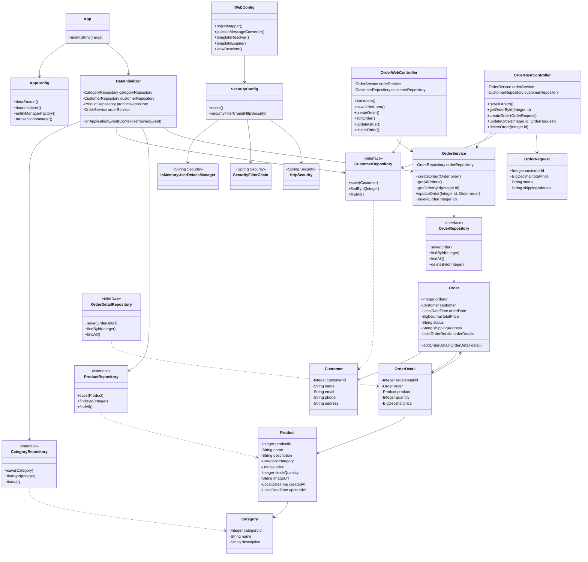

# Лабораторная работа №7

## Spring Security. Basic Authentication

### Цель работы

Добавить безопасность в Web-приложение магазина зоотоваров с использованием Spring Security.

В рамках лабораторной работы необходимо:
- настроить Spring Security;
- добавить пользователей `user` и `manager`;
- реализовать ролевой доступ к операциям с заказами;
- реализовать аутентификацию и авторизацию через форму для Web-интерфейса;
- реализовать Basic Authentication для REST API;
- выполнить сборку приложения в формате WAR;
- развернуть приложение на Apache Tomcat 11;
- протестировать работу Web-интерфейса и REST API;
- обновить UML-диаграмму классов.

---

## 1. Исходное приложение

За основу взят результат выполнения лабораторной работы №6 — Web-приложение магазина зоотоваров с использованием Spring MVC и Thymeleaf.

В приложении используются сущности:
- `Category`;
- `Product`;
- `Customer`;
- `Order`;
- `OrderDetail`.

Для работы с данными используются Spring Framework, Spring MVC, Spring Data JPA, Hibernate и H2 Database.

В предыдущей лабораторной работе были реализованы Web-интерфейс для работы с заказами, REST API, создание, изменение и удаление заказов, сборка WAR и развёртывание на Apache Tomcat 11.0.25.

---

## 2. Используемые технологии

- Java 17;
- Gradle;
- Spring Framework;
- Spring MVC;
- Spring Security;
- Spring Data JPA;
- Hibernate;
- Thymeleaf;
- Jakarta Servlet API;
- Apache Tomcat 11.0.25;
- H2 Database;
- REST API;
- Basic Authentication;
- Form Login;
- curl;
- HTML/CSS;
- Mermaid.

---

## 3. Настройка Spring Security

Для защиты приложения подключены зависимости Spring Security:

```kotlin
implementation("org.springframework.security:spring-security-web:6.4.2")
implementation("org.springframework.security:spring-security-config:6.4.2")
```

Создан класс `SecurityConfig`.

Для подключения Security используется:

```java
@EnableWebSecurity
@Configuration
public class SecurityConfig {
```

Конфигурация Security подключена к Web-контексту через:

```java
@Import(SecurityConfig.class)
```

в классе `WebConfig`.

---

## 4. Пользователи и роли

В приложении созданы два пользователя.

### Пользователь user

```text
Логин: user
Пароль: user
Роль: USER
```

Пользователь `user` имеет право только на просмотр списка заказов.

### Пользователь manager

```text
Логин: manager
Пароль: manager
Роль: MANAGER
```

Пользователь `manager` имеет полный доступ к операциям с заказами:
- просмотр;
- создание;
- изменение;
- удаление.

Пользователи настроены с помощью `InMemoryUserDetailsManager`.

```java
UserDetails user = User
        .withUsername("user")
        .password("{noop}user")
        .roles("USER")
        .build();

UserDetails manager = User
        .withUsername("manager")
        .password("{noop}manager")
        .roles("MANAGER")
        .build();
```

---

## 5. Настройка доступа к Web-интерфейсу

Для Web-интерфейса используется форма аутентификации Spring Security.

```java
.formLogin(form -> form
        .defaultSuccessUrl("/orders", true)
        .permitAll()
)
```

После успешной авторизации пользователь перенаправляется на:

```text
/app/orders
```

### Доступ пользователя user

Пользователь `user` имеет доступ к:

```text
GET /orders
```

При попытке открыть:

```text
GET /orders/new
```

получает:

```text
403 Forbidden
```

Таким образом, пользователь `user` может только просматривать заказы.

### Доступ пользователя manager

Пользователь `manager` имеет доступ ко всем операциям Web-интерфейса:

```text
GET  /orders
GET  /orders/new
POST /orders
GET  /orders/{id}/edit
POST /orders/{id}
POST /orders/{id}/delete
```

---

## 6. Настройка REST API и Basic Authentication

REST API находится по адресу:

```text
/app/api/orders
```

Для REST API используется Basic Authentication:

```java
.httpBasic(basic -> {});
```

Для API настроены следующие правила.

### Получение списка заказов

```text
GET /api/orders
```

доступно обоим пользователям:

```text
USER
MANAGER
```

### Создание заказа

```text
POST /api/orders
```

доступно только:

```text
MANAGER
```

### Изменение заказа

```text
PUT /api/orders/{id}
```

доступно только:

```text
MANAGER
```

### Удаление заказа

```text
DELETE /api/orders/{id}
```

доступно только:

```text
MANAGER
```

Для REST API CSRF-защита отключена:

```java
.csrf(csrf -> csrf
        .ignoringRequestMatchers("/api/**")
)
```

Это позволяет выполнять REST-запросы с Basic Authentication без передачи CSRF-токена.

---

## 7. Тестирование аутентификации

После развёртывания приложения на Apache Tomcat 11.0.25 выполнена проверка доступа без авторизации.

Запрос:

```text
GET http://localhost:8080/app/orders
```

Результат:

```text
HTTP/1.1 401 Unauthorized
```

Сервер запросил данные аутентификации:

```text
WWW-Authenticate: Basic realm="Realm"
```

Таким образом, неавторизованный пользователь не получает доступ к защищённому приложению.

---

## 8. Тестирование Web-интерфейса

### Проверка пользователя user

Выполнен запрос:

```text
GET http://localhost:8080/app/orders
```

с учётными данными:

```text
user:user
```

Получен результат:

```text
HTTP/1.1 200 OK
```

Список заказов успешно отображается.

При попытке открыть форму создания:

```text
GET http://localhost:8080/app/orders/new
```

с учётными данными:

```text
user:user
```

получен результат:

```text
HTTP/1.1 403 Forbidden
```

Таким образом, пользователь `user` не может создавать заказы.

### Проверка пользователя manager

Выполнен запрос:

```text
GET http://localhost:8080/app/orders/new
```

с учётными данными:

```text
manager:manager
```

Получен результат:

```text
HTTP/1.1 200 OK
```

Форма создания заказа успешно открывается.

Web-интерфейс также был проверен непосредственно в браузере. После входа под пользователем `manager` доступны список заказов, создание, изменение и удаление заказов.

---

## 9. Тестирование REST API

REST API тестировался после развёртывания приложения на Apache Tomcat.

Адрес REST API:

```text
http://localhost:8080/app/api/orders
```

### Получение списка заказов

Запрос:

```text
GET /app/api/orders
```

с пользователем `user`:

```text
user:user
```

Результат:

```text
HTTP/1.1 200 OK
```

Запрос с пользователем `manager`:

```text
manager:manager
```

также дал:

```text
HTTP/1.1 200 OK
```

Таким образом, просмотр заказов доступен обоим пользователям.

---

## 10. Создание заказа через REST API

Для создания заказа используется:

```text
POST /app/api/orders
```

### Создание пользователем manager

Запрос:

```text
POST http://localhost:8080/app/api/orders
```

с учётными данными:

```text
manager:manager
```

Тело запроса:

```json
{
    "customerId": 3,
    "totalPrice": 4000,
    "status": "NEW",
    "shippingAddress": "Москва, ул. Арбат, д. 15"
}
```

Получен результат:

```text
HTTP/1.1 201 Created
```

В результате был создан заказ:

```json
{
    "orderId": 2,
    "customer": {
        "customerId": 3,
        "name": "Иван Кузнецов"
    },
    "totalPrice": 4000,
    "status": "NEW",
    "shippingAddress": "Москва, ул. Арбат, д. 15"
}
```

### Создание пользователем user

Аналогичный запрос был выполнен с учётными данными:

```text
user:user
```

Получен результат:

```text
HTTP/1.1 403 Forbidden
```

Таким образом, пользователь `user` не имеет права создавать заказы через REST API.

---

## 11. Изменение заказа через REST API

Для изменения заказа используется:

```text
PUT /app/api/orders/{id}
```

### Изменение пользователем manager

Выполнен запрос:

```text
PUT http://localhost:8080/app/api/orders/1
```

с учётными данными:

```text
manager:manager
```

Тело запроса:

```json
{
    "customerId": 2,
    "totalPrice": 5000,
    "status": "PAID",
    "shippingAddress": "Москва, ул. Тверская, д. 10"
}
```

Получен результат:

```text
HTTP/1.1 200 OK
```

Заказ был успешно изменён.

### Изменение пользователем user

Аналогичный запрос выполнен с:

```text
user:user
```

Получен результат:

```text
HTTP/1.1 403 Forbidden
```

Таким образом, пользователь `user` не может изменять заказы.

---

## 12. Удаление заказа через REST API

Для удаления используется:

```text
DELETE /app/api/orders/{id}
```

### Удаление пользователем manager

Выполнен запрос:

```text
DELETE http://localhost:8080/app/api/orders/2
```

с учётными данными:

```text
manager:manager
```

Получен результат:

```text
HTTP/1.1 204 No Content
```

Заказ был успешно удалён.

### Удаление пользователем user

Повторный запрос на удаление был выполнен с:

```text
user:user
```

Получен результат:

```text
HTTP/1.1 403 Forbidden
```

Таким образом, пользователь `user` не может удалять заказы.

---

## 13. Итоги тестирования REST API

| Операция | user | manager |
|---|---|---|
| `GET /api/orders` | `200 OK` | `200 OK` |
| `POST /api/orders` | `403 Forbidden` | `201 Created` |
| `PUT /api/orders/{id}` | `403 Forbidden` | `200 OK` |
| `DELETE /api/orders/{id}` | `403 Forbidden` | `204 No Content` |

Результаты соответствуют требованиям лабораторной работы.

Пользователь `user` имеет права только на просмотр.

Пользователь `manager` имеет полный доступ к операциям с заказами.

---

## 14. Сборка приложения

Для сборки приложения использовалась команда:

```text
gradle build
```

Получен результат:

```text
BUILD SUCCESSFUL
```

Для формирования WAR-файла использовалась команда:

```text
gradle war
```

Получен результат:

```text
BUILD SUCCESSFUL
```

Сформирован WAR-файл:

```text
app/build/libs/app.war
```

Параметры WAR-файла после сборки:

```text
LastWriteTime : 26.08.2026 13:53:09
Length        : 47177154
```

---

## 15. Развёртывание на Apache Tomcat

Используется:

```text
Apache Tomcat 11.0.25
```

Приложение развёрнуто по адресу:

```text
http://localhost:8080/app
```

WAR-файл:

```text
app/build/libs/app.war
```

был скопирован в:

```text
apache-tomcat-11.0.25/webapps/app.war
```

После запуска Apache Tomcat приложение было автоматически развёрнуто.

Порт:

```text
8080
```

проверен с помощью PowerShell.

Tomcat успешно прослушивает порт `8080`.

---

## 16. Результаты работы

В ходе выполнения лабораторной работы:

- настроен Spring Security;
- подключены зависимости `spring-security-web` и `spring-security-config`;
- создан `SecurityConfig`;
- создан пользователь `user`;
- создан пользователь `manager`;
- настроены роли `USER` и `MANAGER`;
- реализована Form Authentication для Web-интерфейса;
- реализована Basic Authentication для REST API;
- настроен доступ к списку заказов для обоих пользователей;
- ограничен доступ пользователя `user` к созданию заказов;
- ограничен доступ пользователя `user` к изменению заказов;
- ограничен доступ пользователя `user` к удалению заказов;
- предоставлен полный доступ к заказам пользователю `manager`;
- настроены права для REST API;
- отключена CSRF-защита для `/api/**`;
- протестирован доступ без авторизации;
- протестирован Web-интерфейс в браузере;
- протестирован REST API;
- проверено создание заказа;
- проверено изменение заказа;
- проверено удаление заказа;
- проверены ответы `401`, `403`, `200`, `201` и `204`;
- приложение собрано командой `gradle build`;
- сформирован WAR-файл командой `gradle war`;
- получен результат `BUILD SUCCESSFUL`;
- приложение развёрнуто на Apache Tomcat 11.0.25;
- после развёртывания проверена работа Web-интерфейса и REST API.

---

## 17. UML-диаграмма классов

После добавления Spring Security UML-диаграмма дополнена классом `SecurityConfig`.

Основные Web-компоненты:

- `OrderWebController`;
- `OrderRestController`;
- `SecurityConfig`;
- `WebConfig`.

Основные компоненты приложения:

- `App`;
- `AppConfig`;
- `DataInitializer`;
- `OrderService`;
- репозитории;
- сущности магазина.



---

## 18. Вывод

В ходе выполнения лабораторной работы в Web-приложение магазина зоотоваров была добавлена система безопасности Spring Security.

Были созданы два пользователя: `user` и `manager`.

Пользователь `user` получил права только на просмотр заказов. Пользователь `manager` получил полный доступ к операциям создания, изменения и удаления заказов.

Для Web-интерфейса реализована аутентификация через форму Spring Security. Для REST API реализована Basic Authentication.

Выполнено разграничение доступа к REST API:

- `GET` доступен пользователям `USER` и `MANAGER`;
- `POST` доступен только `MANAGER`;
- `PUT` доступен только `MANAGER`;
- `DELETE` доступен только `MANAGER`.

Работа безопасности была проверена после развёртывания приложения на Apache Tomcat 11.0.25.

При обращении без авторизации получен ответ `401 Unauthorized`.

Пользователь `user` успешно получил доступ к просмотру заказов, но при попытке выполнения операций изменения получил ответ `403 Forbidden`.

Пользователь `manager` успешно выполнил создание, изменение и удаление заказов. Были получены ответы `201 Created`, `200 OK` и `204 No Content`.

Приложение успешно собрано в формате WAR с помощью Gradle и развёрнуто на Apache Tomcat 11.0.25.

В результате все основные требования лабораторной работы №7 выполнены.
