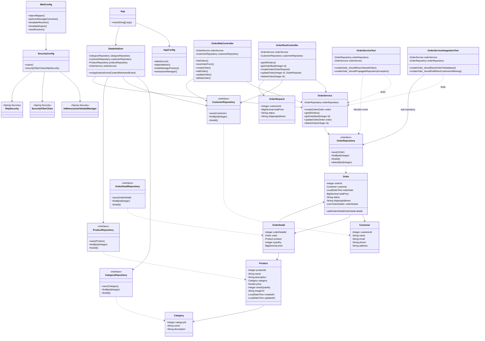

# Лабораторная работа 8. Основы тестирования

## Цель работы

Настроить проект магазина зоотоваров для автоматизированного тестирования, написать модульные и интеграционные тесты для сервиса создания заказа, а также настроить JaCoCo для формирования отчёта о покрытии кода тестами.

## 1. Структура проекта

Основная логика приложения находится в `app/src/main/java/ru/bsuedu/cad/lab/`.

Основные компоненты:

- `OrderService` — сервис работы с заказами;
- `OrderRepository` — Spring Data JPA-репозиторий;
- `Order` — сущность заказа;
- `Customer` — сущность покупателя;
- `AppConfig` — конфигурация Spring, JPA и H2;
- `OrderRestController` — REST API заказов;
- `OrderWebController` — Web-интерфейс заказов;
- `SecurityConfig` — настройка Spring Security.

Тесты находятся в `app/src/test/java/ru/bsuedu/cad/lab/`.

## 2. Unit-тестирование

Для тестирования используется JUnit 5. Для изоляции сервиса от слоя данных подключены Mockito и `mockito-junit-jupiter`.

`OrderService` работает с `OrderRepository`:

```java
@Transactional
public Order createOrder(Order order) {
    return orderRepository.save(order);
}
```

Unit-тесты проверяют сервис изолированно от базы данных.

### Проверенные сценарии

**Успешное создание заказа**

Проверяется вызов `orderRepository.save(order)` и корректность возвращаемого сохранённого заказа.

**Неудачное создание заказа**

Проверяется корректная передача исключения, возникающего при сохранении заказа в репозитории.

## 3. Интеграционное тестирование

Для интеграционных тестов используется Spring Test и конфигурация:

```java
@SpringJUnitConfig(AppConfig.class)
```

В тестах используются настоящий Spring-контекст, настоящий `OrderRepository` и H2-база данных в памяти.

Схема взаимодействия:

```text
OrderService
     |
     v
OrderRepository
     |
     v
Spring Data JPA
     |
     v
Hibernate
     |
     v
H2
```

### Успешный сценарий

Создаётся заказ через `OrderService.createOrder()`. После сохранения заказ повторно читается через настоящий `OrderRepository`. Проверяются идентификатор, сумма, статус и адрес доставки.

### Неудачный сценарий

Создаётся заказ без покупателя. Поле покупателя является обязательным:

```java
@ManyToOne
@JoinColumn(name = "customer_id", nullable = false)
private Customer customer;
```

Поэтому попытка сохранения некорректного заказа приводит к исключению, что проверяется интеграционным тестом.

## 4. JaCoCo

Для анализа покрытия кода тестами используется JaCoCo.

Отчёт формируется командой:

```powershell
gradle jacocoTestReport
```

HTML-отчёт находится по пути:

```text
app/build/reports/jacoco/test/html/index.html
```

Генерация отчёта выполнена успешно.

## 5. Результаты тестирования

Для запуска тестов используется:

```powershell
gradle test
```

Результат:

```text
BUILD SUCCESSFUL
5 actionable tasks: 3 executed, 2 up-to-date
```

В результате:

- Unit-тесты успешно компилируются и выполняются;
- интеграционные тесты успешно запускаются;
- Spring-контекст для интеграционных тестов успешно создаётся;
- взаимодействие `OrderService` с `OrderRepository` проверено;
- работа с H2 проверена;
- успешный и неуспешный сценарии взаимодействия слоёв протестированы.

JaCoCo также успешно сформировал HTML-отчёт:

```text
BUILD SUCCESSFUL
5 actionable tasks: 5 up-to-date
```

## 6. UML-диаграмма классов

Диаграмма основана на структуре приложения из предыдущей лабораторной работы и дополнена классами тестов `OrderServiceTest` и `OrderServiceIntegrationTest`.



## 7. Вывод

В ходе лабораторной работы проект магазина зоотоваров был подготовлен к автоматизированному тестированию.

Были выполнены следующие работы:

- настроено выполнение тестов JUnit 5;
- подключён Mockito для Unit-тестирования;
- написаны тесты успешного и неуспешного создания заказа;
- настроен JaCoCo;
- сформирован HTML-отчёт о покрытии;
- подключён Spring Test;
- реализованы интеграционные тесты;
- проверено взаимодействие `OrderService` с настоящим `OrderRepository`;
- проверена работа с H2;
- протестированы успешный и неуспешный сценарии взаимодействия слоёв;
- добавлена UML-диаграмма классов в формате Mermaid.

Все тесты завершились успешно, сборка проекта выполняется без ошибок.
